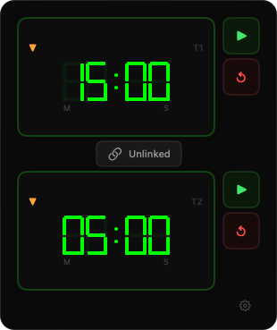

# Pomodoro

A minimal Pomodoro timer that lives in your macOS menu bar.



## Features

- **Dual timers** with seven-segment display — use independently or chain them together
- **Chained mode** links Timer 1 and Timer 2 so they run back-to-back with an alarm between each
- **Countdown and count-up** modes per timer
- **Alarm** loops until you silence it — never miss the end of a session
- **Keyboard driven** — click digits to edit, use arrow keys to adjust, spacebar to play/pause, R to reset, 1/2 to switch focus
- **Customisable** digit colour, default times, and window size
- **Menu bar only** — no dock icon, stays out of your way

## Install

### Homebrew

```
brew install typingincolor/tap/pomodoro
```

### Manual

Download the latest `.dmg` from [Releases](https://github.com/typingincolor/pomodoro/releases), open it, and drag Pomodoro to Applications.

## Build from source

```
git clone https://github.com/typingincolor/pomodoro.git
cd pomodoro
xcodebuild -scheme Pomodoro -configuration Release build
```

Requires Xcode 15+ and macOS 14+.

## Usage

Click the timer icon in the menu bar to open the timer panel. Click on the digits to edit them, then press play.

**Chained mode:** Click the chain link between the two timers to link them. Timer 2 starts automatically when Timer 1 finishes.

**Settings:** Click the gear icon to configure digit colour, default times, and window size.

## License

MIT
